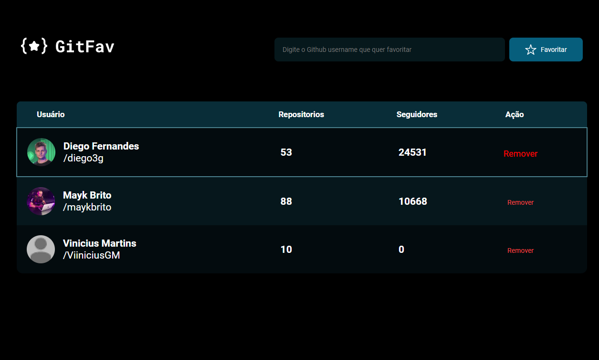

<h1> Desafio GitHub Favorites! 
  <h4>https://github-favorites-79suxieo0-viiniciusgm.vercel.app/
  
##

##

Desafio 2 do Stage 6 da Rockeseat 💜🚀

##
<h1>
  Tecnologias Utilizadas
</h1>

    
    
    

##
<ul>
  <li>ES6 Modules
  <li>Classes
  <li>Promessas
  <li>Async e Await
<ul>
